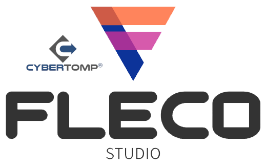

# PROJECT STATUS

## Master branch:


## Development branch:


# THE PROJECT



**CyberTOMP® FLECO Studio** is a visual tool designed to interact with the CyberTOMP® FLECO Library and support an organization's cybersecurity team in developing holistic cybersecurity by implementing the CyberTOMP® Framework [1]. It also serves as a cornerstone for creating cyber situational awareness programs aimed at enhancing the cybersecurity skills of individuals involved in corporate cybersecurity [2], [3].

1. M. Domínguez-Dorado, F. J. Rodríguez-Pérez, J. Galeano-Brajones, J. Calle-Cancho, and D. Cortés-Polo, “[FLECO: A tool to boost the adoption of holistic cybersecurity management](https://doi.org/10.1016/j.simpa.2024.100614),” *Software Impacts*, vol. 19, no. 100614, pp. 1–4, Jan. 2024. DOI: [10.1016/j.simpa.2024.100614](https://doi.org/10.1016/j.simpa.2024.100614).
1. M. Domínguez-Dorado, D. Cortés-Polo, F. J. Rodríguez-Pérez, J. Galeano-Brajones, J. Calle-Cancho, "[Version 2.0 — FLECO, enhancements for cyber situational awareness training and research](https://doi.org/10.1016/j.simpa.2025.100800)", Software Impacts, Volume 26,2025, 100800.
1. M. Domínguez-Dorado, F. J. Rodríguez-Pérez, D. Cortés-Polo, J. Galeano-Brajones, and J. Calle-Cancho, “[Integration of Scenario-Based Learning in CyberTOMP with FLECO Studio: Enhancing Situational Awareness Training in Cybersecurity](https://doi.org/10.1109/RITA.2025.3616004),” *IEEE Revista Iberoamericana de Tecnologías del Aprendizaje*, vol. 20, pp. 310–320, Oct. 2025. DOI: [10.1109/RITA.2025.3616004](https://doi.org/10.1109/RITA.2025.3616004).

# LICENSE

## Latest snapshot version being developed:

- <b>CyberTOMP® FLECO Studio v2-SNAPSHOT</b> (develop branch) - LGPL-3.0-or-later.

## Binary releases:
 
- <b>CyberTOMP® FLECO Studio v1</b> (current, master branch) - LGPL-3.0-or-later.
- <b>FLECO 2.0</b> LGPL-3.0-or-later.
- <b>FLECO 1.4</b> LGPL-3.0-or-later.
- <b>FLECO 1.3</b> LGPL-3.0-or-later.
- <b>FLECO 1.2</b> LGPL-3.0-or-later.
- <b>FLECO 1.1</b> LGPL-3.0-or-later.
- <b>FLECO 1.0</b> LGPL-3.0-or-later.

# PEOPLE BEHIND FLECO

## DEVELOPMENT LEADER:
    
 - Manuel Domínguez-Dorado - <ingeniero@ManoloDominguez.com>
   
# COMPILING FROM SOURCES

The optimal course of action entails acquiring the most recent compiled stable releases from the releases section of this repository. Nevertheless, if one desires to assess novel functionalities, it becomes imperative to compile the project from its sources. The subsequent instructions outline the necessary steps to accomplish this task:

- Clone the CyberTOMP® FLECO Studio repository: 

```console
git clone https://github.com/cybertomp-framework/cybertomp-fleco-studio.git
```

- To obtain a binary JAR file containing all the necessary components, it is essential to compile the code. Prior to that, it is imperative to install Maven:

```console
cd cybertomp-fleco-studio
mvn package
```

- The jar file will be located in "target" directory.

```console
cd target
```
- Now, run CyberTOMP® FLECO Studio:

```console
java -jar cybertomp-fleco-studio-{YourVersion}-with-dependencies.jar

```
# THIRD-PARTY COMPONENTS

CyberTOMP® FLECO Studio utilizes several third-party components, each of which is governed by its own open-source software (OSS) license. In order to ensure compliance with these licenses, thorough consideration has been given to enable the release of CyberTOMP® FLECO Studio under its existing OSS license. The components integrated within CyberTOMP® FLECO Studio encompass the following:

- cybertomp-fleco-library - LGPL-3.0-or-later - https://github.com/cybertomp-framework/cybertomp-fleco-library
- unirest-java-core 4.2.7 - MIT - https://kong.github.io/unirest-java/
- miglayout-swing 11.3 - BSD-3-clause - https://github.com/mikaelgrev/miglayout
- miglayout-core 11.3 - BSD-3-clause - https://github.com/mikaelgrev/miglayout
- everit-json-schema 1.14.4 - Apache-2.0 - https://github.com/everit-org/json-schema
- slf4j-api 2.1.0-alpha1 - MIT - https://www.slf4j.org
- slf4j-simple 2.1.0-alpha1 - MIT - https://www.slf4j.org
- TableColumnAdjuster - Public-Domain - https://tips4java.wordpress.com/2008/11/10/table-column-adjuster/

Thanks folks!

# USING CyberTOMP® FLECO STUDIO

Utilizing CyberTOMP® FLECO Studio follows a streamlined approach. Once the compilation process is complete, the subsequent step merely involves executing the following command:

```console
java -jar cybertomp-fleco-studio-{YourVersion}-with-dependencies.jar
``` 

Upon execution, CyberTOMP® FLECO Studio will automatically launch, providing a user-friendly interface conveniently contained within a single window. To initiate a new case, simply navigate to the "Case" menu and select the "New" option.


Following the selection of the desired implementation group, a comprehensive table containing all the pertinent information is presented.


Modifiable data can be directly edited within the table by clicking on the corresponding cell. For instance, the initial status, referred to as the current status, should be adjusted to accurately reflect the actual cybersecurity status of each defined cybersecurity action in CyberTOMP® Framework, thereby representing the real status of the assets. Additionally, strategic constraints and goals can be defined using the "Constraint operator" and "Constraint value" columns. For example, consider the CyberTOMP® Framework metric "ID" with a current status of "0.37425002". By selecting a constraint operator of "GREATER" and a constraint value of "0.8", CyberTOMP® FLECO Studio is directed to seek a set of cybersecurity actions that collectively ensure the CyberTOMP® Framework metric "ID" exceeds (strictly) 0.8.


Once the current status of the asset has been comprehensively defined and the desired strategic goals and constraints have been configured within CyberTOMP® FLECO Studio, it is time to invoke CyberTOMP® FLECO algorithm in order to obtain a solution. This can be achieved by selecting the "Run FLECO" option located in the "Case" menu or by clicking on the corresponding icon within the toolbar.


CyberTOMP® FLECO Studio will initiate the computation of a set of cybersecurity actions aimed at attaining the predefined cybersecurity goals. Throughout this process, a progress bar located at the bottom of the window will provide real-time updates on the progress. Upon completion of the computation and successful achievement of a solution, the progress bar will display 100%. CyberTOMP® FLECO Studio will then present the corresponding values associated with the target status, representing the state that, starting from the current state, enables the fulfillment of the strategic cybersecurity goals and constraints. In the "Target status" column, values requiring further attention or action will be highlighted in red. This indication corresponds to the Discrete Level of Implementation (DLI) defined within the CyberTOMP® Framework.

Each value in a cell within the "Target status" column signifies a specific cybersecurity action that must be undertaken by a designated functional area. The degree of implementation and level of detail required for each action varies based on the value in the cell. These cybersecurity actions are thoroughly documented as an integral part of the CyberTOMP® Framework, which can be accessed through the provided link.


If alternative solutions exist, they can be obtained by re-running CyberTOMP® FLECO algorithm.

CyberTOMP® FLECO Studio offers online assistance for any of the existing metrics. This enables the cybersecurity team to engage in continuous learning and effectively involves all the required areas. To access this help, you just need to double-click on the row of the metric you wish to inquire about, in any of the first three columns (CyberTOMP® Framework metric, Purpose, Leading functional area), as shown in the following image.


Furthermore, CyberTOMP® FLECO Studio provides additional features. For instance, it allows the ability to save the case as a JSON file and load it from disk. This functionality facilitates the seamless collaboration of the cross-functional cybersecurity workforce, enabling them to effectively work on the cybersecurity aspects of the corresponding asset continuously.
